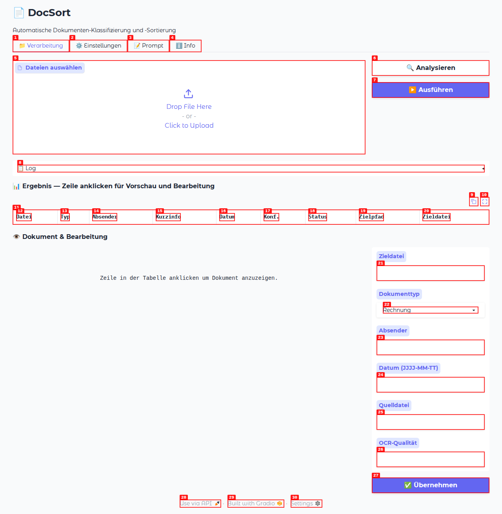
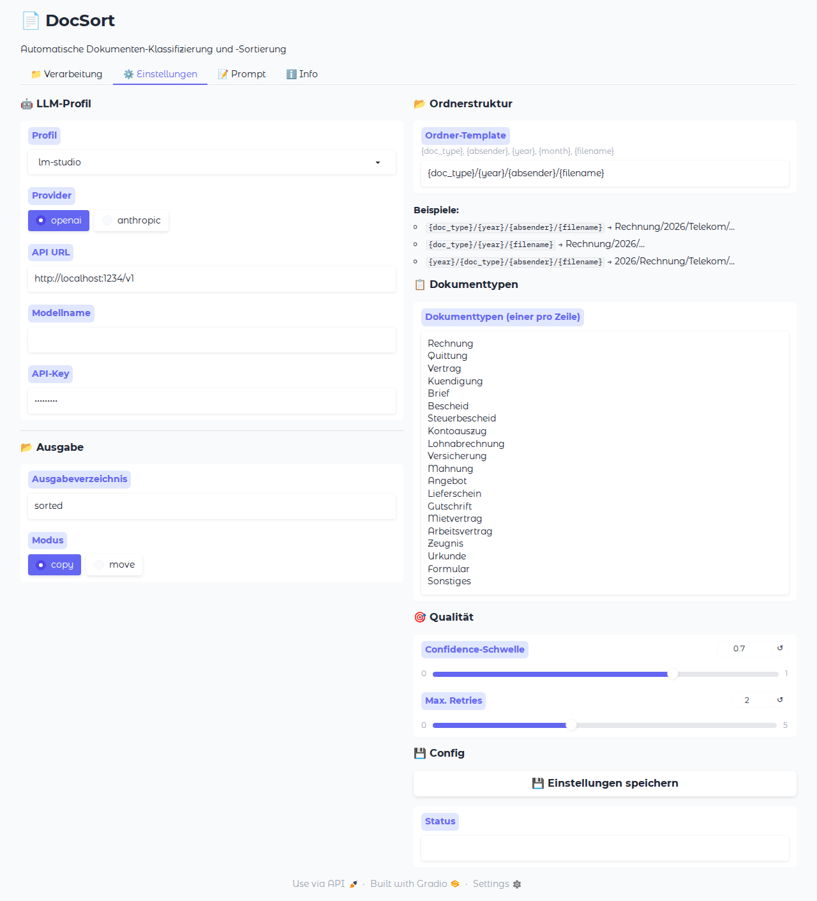
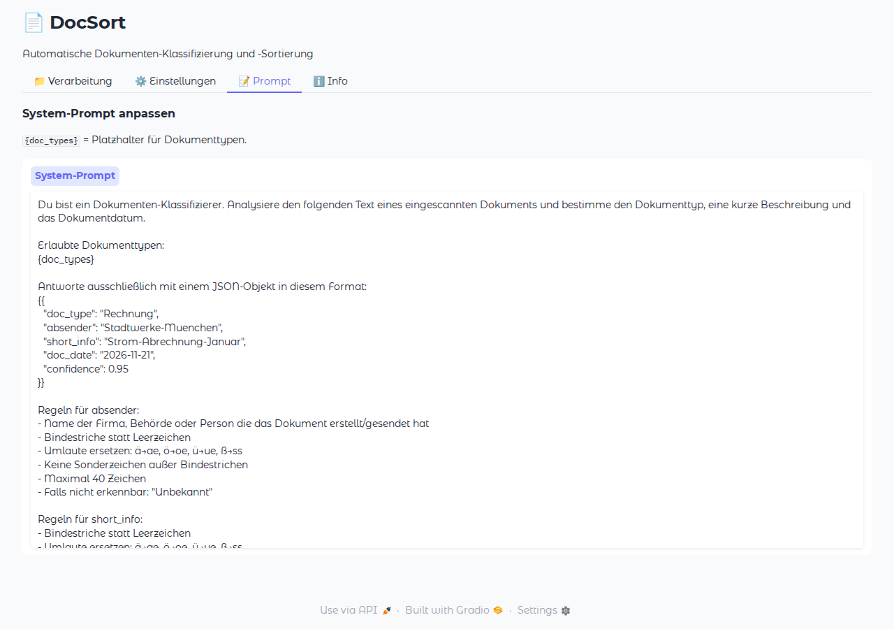
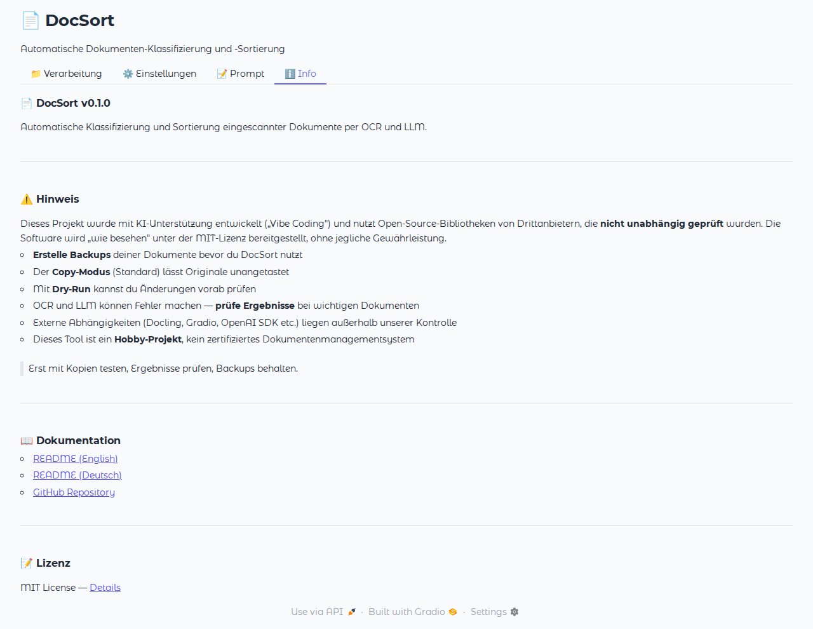

# 📄 DocSort

> 🇬🇧 [English Version](README.md)

**Automatische Klassifizierung und Sortierung eingescannter Dokumente per OCR und lokalem LLM.**

DocSort liest eingescannte Dokumente (PDF, DOCX, XLSX, Bilder etc.) ein, extrahiert den Text per OCR, klassifiziert den Dokumenttyp per LLM und sortiert die Dateien automatisch in eine einheitliche Ordnerstruktur mit sprechendem Dateinamen.

---

## ✨ Features

- **Universelle Dokumentenformate** — PDF, DOCX, XLSX, PPTX, ODT, JPG, PNG, TIFF und mehr
- **Smarte Text-Extraktion** — PyMuPDF für digitale PDFs (<1s), GPU-beschleunigte OCR via Docling nur für gescannte Dokumente
- **Multi-LLM Support** — LM Studio, Ollama, OpenAI, Anthropic Claude, Google Gemini
- **Einheitliche Benennung** — `JJJJ-MM-TT_Dokumenttyp-Kurzinfo.ext`
- **Flexible Ordnerstruktur** — konfigurierbares Template (`{doc_type}/{year}`, `{year}/{doc_type}` etc.)
- **YAML-Konfiguration** — alle Einstellungen persistent in `docsort.yaml`
- **LLM-Profile** — schnell zwischen Providern wechseln
- **Anpassbarer System-Prompt** — Klassifizierung individuell steuern
- **Confidence-Schwelle** — unsichere Klassifizierungen werden markiert
- **Retry-Logik** — automatische Wiederholung bei LLM-Fehlern
- **Undo-Funktion** — Operationen rückgängig machen per Undo-Log
- **Copy & Move Modus** — Originale bleiben erhalten (Standard) oder werden verschoben
- **Dry-Run** — Vorschau ohne Änderungen
- **CLI & Web-UI** — Kommandozeile (Click) oder grafische Oberfläche (Gradio)
- **OCR-Qualitäts-Check** — Warnung bei leerem oder unleserlichem Text
- **Watchfolder** — Verzeichnis überwachen und neue Dateien automatisch verarbeiten
- **Dokument-Vorschau** — PDF/Bild-Preview direkt in der Web-UI
- **Fehlertoleranz** — Eine fehlerhafte Datei stoppt nicht den Rest

---

## ⚠️ Hinweis / Haftungsausschluss

Dieses Projekt wurde mit KI-Unterstützung entwickelt („Vibe Coding") und nutzt Open-Source-Bibliotheken von Drittanbietern, die **nicht unabhängig geprüft** wurden. Die Software wird „wie besehen" unter der MIT-Lizenz bereitgestellt, ohne jegliche Gewährleistung.

**Bitte beachten:**
- **Erstelle Backups deiner Dokumente** bevor du DocSort nutzt — besonders im `--move` Modus (verschiebt Originale)
- Der `--copy` Modus (Standard) lässt deine Originale unangetastet — nutze ihn bis du den Ergebnissen vertraust
- Mit `--dry-run` kannst du alle Änderungen vorab prüfen ohne dass etwas passiert
- OCR und LLM-Klassifizierung können Fehler machen — prüfe Ergebnisse bei wichtigen Dokumenten immer nach
- Externe Abhängigkeiten (Docling, Gradio, OpenAI SDK etc.) werden von ihren jeweiligen Projekten gepflegt — Sicherheitslücken in diesen Paketen liegen außerhalb unserer Kontrolle
- Dieses Tool ist ein privates Hobby-Projekt, kein zertifiziertes Dokumentenmanagementsystem

> **Kurzfassung:** Erst mit Kopien testen, Ergebnisse prüfen, Backups behalten. Verlass dich nicht blind auf KI-Klassifizierung bei rechtlich oder finanziell kritischen Dokumenten.

---

## 📋 Voraussetzungen

| Komponente | Version | Hinweis |
|---|---|---|
| **Python** | 3.11+ | Empfohlen: 3.12 |
| **uv** | aktuell | Paketmanager ([Installieren](https://docs.astral.sh/uv/getting-started/installation/)) |
| **LLM-Server** | — | LM Studio, Ollama (lokal) oder Cloud-API (OpenAI, Claude, Gemini) |
| **NVIDIA GPU** | optional | Empfohlen: RTX 4070 Ti SUPER (12 GB VRAM) |
| **CUDA** | 12.8 | Für GPU-Beschleunigung |

> **Hinweis:** Digitale PDFs (mit Textebene) werden blitzschnell per PyMuPDF extrahiert — dafür wird keine GPU benötigt. GPU-Beschleunigung ist nur für gescannte Dokumente und Bilder relevant, die per Docling OCR verarbeitet werden.

### LLM einrichten

DocSort unterstützt 5 LLM-Provider out of the box:

| Provider | Typ | Kosten | Setup |
|---|---|---|---|
| **LM Studio** | Lokal | Kostenlos | [lmstudio.ai](https://lmstudio.ai/) → Modell laden → Server starten |
| **Ollama** | Lokal | Kostenlos | [ollama.com](https://ollama.com/) → `ollama pull llama3` |
| **OpenAI** | Cloud | ~$0.003/Dok | API-Key von [platform.openai.com](https://platform.openai.com/) |
| **Anthropic Claude** | Cloud | ~$0.003/Dok | API-Key von [console.anthropic.com](https://console.anthropic.com/) |
| **Google Gemini** | Cloud | ~$0.001/Dok | API-Key von [aistudio.google.com](https://aistudio.google.com/) |

> **Empfehlung für den Start:** LM Studio oder Ollama — kostenlos, lokal, keine Daten verlassen den Rechner.

---

## 🚀 Installation

### 1. Repository klonen

```bash
git clone https://github.com/ichabot/docsort.git
cd docsort
```

### 2. Python-Umgebung erstellen (mit uv)

```bash
uv venv
source .venv/bin/activate   # Linux/macOS
# .venv\Scripts\activate    # Windows
```

### 3. PyTorch mit CUDA installieren (GPU)

```bash
uv pip install torch torchvision torchaudio --index-url https://download.pytorch.org/whl/cu128
```

> **Ohne GPU?** Diesen Schritt überspringen — DocSort fällt automatisch auf CPU zurück.

### 4. DocSort installieren

```bash
# Standard-Installation (OpenAI-kompatible LLMs)
uv pip install -e .

# Mit Anthropic Claude Support
uv pip install -e ".[anthropic]"

# Mit allem (Anthropic + Dev-Tools)
uv pip install -e ".[all-llm,dev]"
```

### 5. OnnxTR OCR-Engine (optional, empfohlen)

```bash
uv pip install "docling-ocr-onnxtr[gpu]"
```

### 6. Config erstellen

```bash
docsort init
```

Erstellt eine `docsort.yaml` mit allen Einstellungen. Alternativ `docsort.example.yaml` als Vorlage nutzen.

---

## 🔧 Konfiguration

DocSort wird über eine YAML-Datei konfiguriert. Suchpfade:
1. `./docsort.yaml` (aktuelles Verzeichnis)
2. `~/.config/docsort/docsort.yaml`

### Beispiel-Config

```yaml
# Aktives LLM-Profil
active_profile: lm-studio

# Eigene Profile hinzufügen/anpassen
profiles:
  openai:
    api_key: sk-dein-key-hier
  anthropic:
    api_key: sk-ant-dein-key-hier
  mein-server:
    provider: openai
    base_url: http://192.168.1.100:8080/v1
    model: mein-modell
    api_key: optional
    description: Mein eigener LLM-Server

# Ausgabe
output_dir: ./sorted
mode: copy

# Ordnerstruktur-Template
folder_template: "{doc_type}/{year}/{filename}"

# Qualität
confidence_threshold: 0.7
max_retries: 2

# Undo-Log aktivieren
undo_log: ./docsort_undo.csv
```

### LLM-Profile

Eingebaute Profile:

| Profil | Provider | URL | Standard-Modell |
|---|---|---|---|
| `lm-studio` | openai | `localhost:1234/v1` | (LM Studio Standard) |
| `ollama` | openai | `localhost:11434/v1` | `llama3` |
| `openai` | openai | `api.openai.com/v1` | `gpt-4o-mini` |
| `anthropic` | anthropic | `api.anthropic.com` | `claude-sonnet-4-20250514` |
| `gemini` | openai | `generativelanguage.googleapis.com/...` | `gemini-2.0-flash` |

Profile anzeigen:

```bash
docsort profiles
```

### Ordnerstruktur-Template

Das Template bestimmt die Ordnerstruktur. Verfügbare Variablen:

| Variable | Beschreibung | Beispiel |
|---|---|---|
| `{doc_type}` | Dokumenttyp | `Rechnung` |
| `{absender}` | Absender/Aussteller | `Stadtwerke-Muenchen` |
| `{year}` | Jahr aus Dokumentdatum | `2026` |
| `{month}` | Monat aus Dokumentdatum | `03` |
| `{filename}` | Generierter Dateiname | `2026-03-15_Strom-Abrechnung.pdf` |

Beispiele:

```yaml
# Standard: Typ → Jahr → Absender (empfohlen)
folder_template: "{doc_type}/{year}/{absender}/{filename}"
# → sorted/Rechnung/2026/Stadtwerke-Muenchen/2026-01-15_Strom-Abrechnung.pdf

# Ohne Absender-Ordner
folder_template: "{doc_type}/{year}/{filename}"
# → sorted/Rechnung/2026/2026-01-15_Strom-Abrechnung.pdf

# Jahr zuerst
folder_template: "{year}/{doc_type}/{absender}/{filename}"
# → sorted/2026/Rechnung/Stadtwerke-Muenchen/2026-01-15_Strom-Abrechnung.pdf

# Flach (keine Unterordner)
folder_template: "{filename}"
# → sorted/2026-01-15_Strom-Abrechnung.pdf
```

### System-Prompt anpassen

Der System-Prompt steuert wie das LLM Dokumente klassifiziert. Du kannst ihn in der Config oder im Web-UI anpassen:

```yaml
system_prompt: |
  Du bist ein Dokumenten-Klassifizierer für eine Arztpraxis.
  Analysiere den folgenden Text und klassifiziere das Dokument.
  
  Erlaubte Dokumenttypen:
  {doc_types}
  
  Antworte mit JSON:
  {"doc_type": "...", "short_info": "...", "doc_date": "JJJJ-MM-TT", "confidence": 0.95}
```

> **Hinweis:** `{doc_types}` wird automatisch durch die konfigurierte Dokumenttypen-Liste ersetzt.

### Dokumenttypen anpassen

```yaml
doc_types:
  - Rechnung
  - Vertrag
  - Arztbrief
  - Laborbefund
  - Rezept
  - Überweisung
  - Sonstiges
```

---

## 💻 Nutzung

### CLI — Kommandozeile

#### Dokumente verarbeiten

```bash
# Standard (nutzt docsort.yaml)
docsort process ./scans

# Ausgabeverzeichnis angeben
docsort process ./scans -o ./archiv

# Dry-Run: nur Vorschau
docsort process ./scans --dry-run

# Mit bestimmtem LLM-Profil
docsort process ./scans --profile openai

# Dateien verschieben statt kopieren
docsort process ./scans --move

# Alle Optionen
docsort process ./scans \
    -o ./archiv \
    --move \
    --profile anthropic \
    --batch-size 16 \
    --verbose
```

#### CLI-Optionen

| Option | Beschreibung | Standard |
|---|---|---|
| `-o, --output` | Ausgabeverzeichnis | `./sorted` |
| `--copy / --move` | Kopieren oder verschieben | `--copy` |
| `--dry-run` | Nur Vorschau | aus |
| `--profile` | LLM-Profil | aus Config |
| `--llm-url` | LLM API URL (überschreibt Profil) | — |
| `--model` | Modellname (überschreibt Profil) | — |
| `--api-key` | API-Key (überschreibt Profil) | — |
| `--no-gpu` | GPU deaktivieren | GPU an |
| `--batch-size` | OCR Batch-Größe | `32` |
| `--config` | Pfad zur Config-Datei | auto |
| `-v, --verbose` | Ausführliche Ausgabe | aus |

#### Watchfolder — automatische Verarbeitung

```bash
# Verzeichnis überwachen (prüft alle 5 Sekunden)
docsort watch ./scans -o ./sorted

# Mit kürzerem Intervall
docsort watch ./scans --interval 2

# Mit bestimmtem Profil und Move-Modus
docsort watch ./scans -o ./archiv --profile openai --move
```

Neue Dateien im überwachten Verzeichnis werden automatisch erkannt, per OCR gelesen, klassifiziert und einsortiert. Bereits verarbeitete Dateien werden nicht erneut verarbeitet. Beenden mit `Ctrl+C`.

#### Weitere Kommandos

```bash
# Config erstellen
docsort init

# LLM-Profile anzeigen
docsort profiles

# Letzte Operationen rückgängig machen
docsort undo           # alle
docsort undo -n 5      # letzte 5
```

### Web-UI — Grafische Oberfläche

```bash
# Standard auf Port 7860
docsort web

# Anderer Port
docsort web --port 8080

# Öffentlicher Link
docsort web --share
```

Die Web-UI hat vier Tabs:

1. **📁 Verarbeitung** — Dateien hochladen, Analysieren & Ausführen
   - Ergebnis-Tabelle (read-only) mit Status und OCR-Qualität
   - **Seitenpanel**: Zeile anklicken → PDF/Bild-Vorschau + Edit-Felder
   - Dokumenttyp, Kurzinfo und Datum direkt korrigieren
   - Änderungen übernehmen → Tabelle aktualisiert sich
2. **⚙️ Einstellungen** — LLM-Profil, Ausgabe, Ordnerstruktur, Dokumenttypen, Confidence-Schwelle
3. **📝 System-Prompt** — Klassifizierungs-Prompt anpassen
4. **ℹ️ Info** — Versionsinformationen, Pipeline-Übersicht und Hilfe

#### Screenshots

| Verarbeitung | Einstellungen |
|:---:|:---:|
|  |  |

| System-Prompt | Info |
|:---:|:---:|
|  |  |

---

## 📁 Ausgabe-Schema

### Dateinamen

```
JJJJ-MM-TT_Kurzinfo.ext
```

Beispiele:
- `2026-11-21_Strom-Abrechnung-Januar.pdf`
- `2025-06-01_Haftpflicht-Jahresbeitrag.pdf`
- `2026-03-10_Einkommensteuer-2025.pdf`

> Dokumenttyp und Absender stehen im Ordnerpfad und werden nicht im Dateinamen wiederholt.

### Kurzinfo-Regeln

- Bindestriche statt Leerzeichen
- Umlaute werden ersetzt: `ä→ae`, `ö→oe`, `ü→ue`, `ß→ss`
- Keine Sonderzeichen außer Bindestrichen
- Maximal 60 Zeichen
- Kein Datum in der Kurzinfo

### Standard-Dokumenttypen

Rechnung · Quittung · Vertrag · Kuendigung · Brief · Bescheid · Steuerbescheid · Kontoauszug · Lohnabrechnung · Versicherung · Mahnung · Angebot · Lieferschein · Gutschrift · Mietvertrag · Arbeitsvertrag · Zeugnis · Urkunde · Formular · Sonstiges

> Über die Config oder Web-UI können eigene Dokumenttypen definiert werden.

### Duplikate

Bei Namenskollisionen: `_2`, `_3` etc.

---

## 🏗️ Projektstruktur

```
docsort/
├── pyproject.toml              # Projekt-Konfiguration & Dependencies
├── docsort.yaml                # Deine Config (nach docsort init)
├── docsort.example.yaml        # Beispiel-Config als Vorlage
├── README.md
├── LICENSE
├── .gitignore
├── src/
│   └── docsort/
│       ├── __init__.py         # Package-Init + Version
│       ├── config.py           # YAML-Config, LLM-Profile, Laden/Speichern
│       ├── extractor.py        # Text-Extraktion: PyMuPDF Fast-Path + Docling OCR Fallback + Qualitäts-Check
│       ├── classifier.py       # Multi-LLM Klassifizierung (OpenAI + Anthropic)
│       ├── organizer.py        # Dateien umbenennen + sortieren + Undo-Log
│       ├── pipeline.py         # Orchestriert: extract → classify → organize
│       ├── cli.py              # Click CLI (process, web, watch, undo, init, profiles)
│       ├── web.py              # Gradio Web-UI mit Seitenpanel + PDF-Preview
│       └── watcher.py          # Watchfolder — automatische Verarbeitung
└── tests/
    ├── __init__.py
    └── test_pipeline.py        # Unit-Tests (55 Tests)
```

### Pipeline-Ablauf

```
Eingabe-Datei
    │
    ▼
[1. Extractor]  ─── PyMuPDF (digitale PDFs) oder Docling OCR (Scans/Bilder) → Text + Metadaten
    │
    ▼
[2. Classifier] ─── LLM (wählbar) → Typ, Kurzinfo, Datum, Konfidenz
    │                 ↻ Retry bei Fehler
    │                 ⚠ Warnung bei niedriger Konfidenz
    ▼
[3. Organizer]  ─── Template → Zielpfad → Kopieren/Verschieben
    │                 📝 Undo-Log schreiben
    ▼
Sortierte Datei in Zielordner
```

---

## 🧪 Tests

```bash
# Tests ausführen
pytest

# Mit ausführlicher Ausgabe
pytest -v

# Mit Coverage-Report
pytest --cov=docsort --cov-report=term-missing
```

55 Tests decken ab:
- Kurzinfo-Bereinigung (Umlaute, Sonderzeichen, Längenbegrenzung)
- JSON-Extraktion (direkt, Markdown-Codeblock, eingebettet)
- Datums-Fallback-Logik (LLM → Datei → heute)
- Zielpfad-Aufbau mit verschiedenen Templates
- Duplikat-Auflösung
- Datei-Organisation (Dry-Run, Copy, Move, Undo-Log)
- Dateisammlung (rekursiv, einzeln, leer, ungültig)
- Config-System (Profile, YAML laden/speichern, Defaults)
- OCR-Qualitäts-Erkennung (leer, wenig Text, Garbage-Zeichen)
- Watchfolder (Datei-Stabilität, Run-Once)

---

## ⚡ GPU-Konfiguration

### Empfohlene Einstellungen (RTX 4070 Ti SUPER, 12 GB VRAM)

| Parameter | Wert |
|---|---|
| `ocr_batch_size` | `16` bis `32` |
| CUDA Version | 12.8 |

> **Hinweis:** GPU wird nur für gescannte Dokumente und Bilder benötigt (Docling OCR). Digitale PDFs mit Textebene werden per PyMuPDF extrahiert und brauchen weder GPU noch OCR.

GPU deaktivieren:

```bash
docsort process ./scans --no-gpu
```

DocSort erkennt automatisch, ob CUDA verfügbar ist und fällt bei Bedarf auf CPU zurück. Für digitale PDFs wird keine GPU benötigt — PyMuPDF extrahiert den Text direkt aus der Textebene.

---

## 📝 Lizenz

MIT License — siehe [LICENSE](LICENSE)
